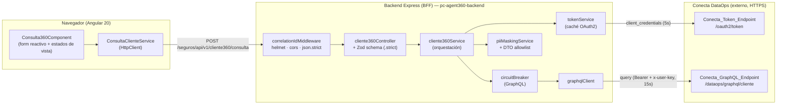
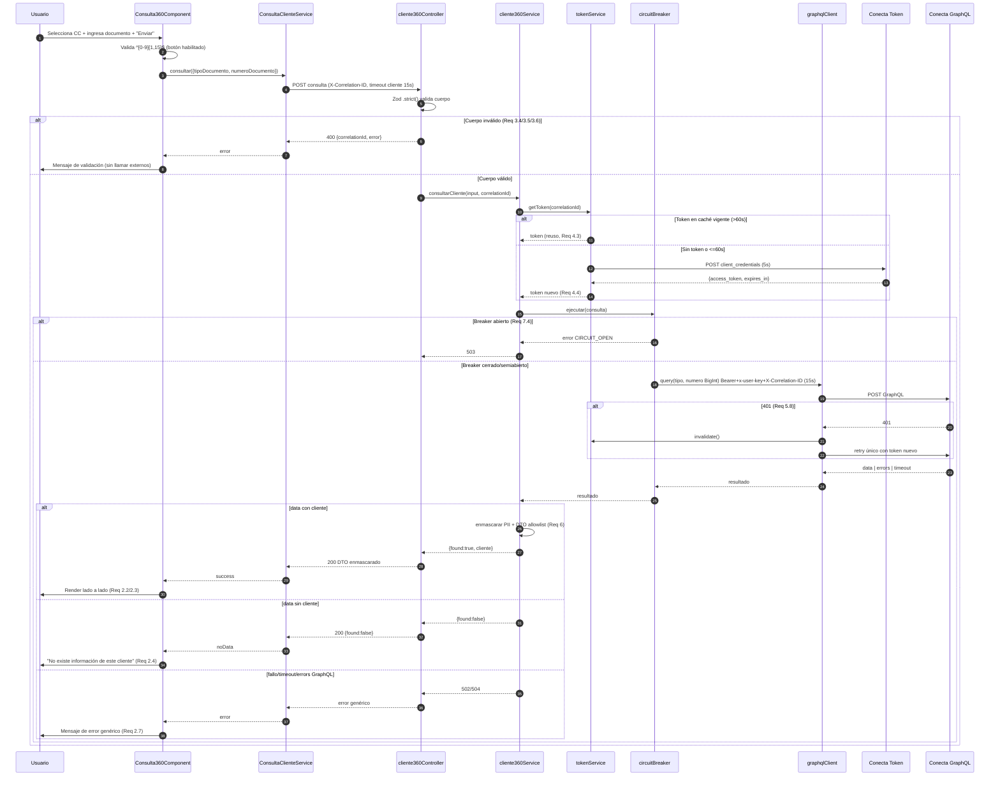
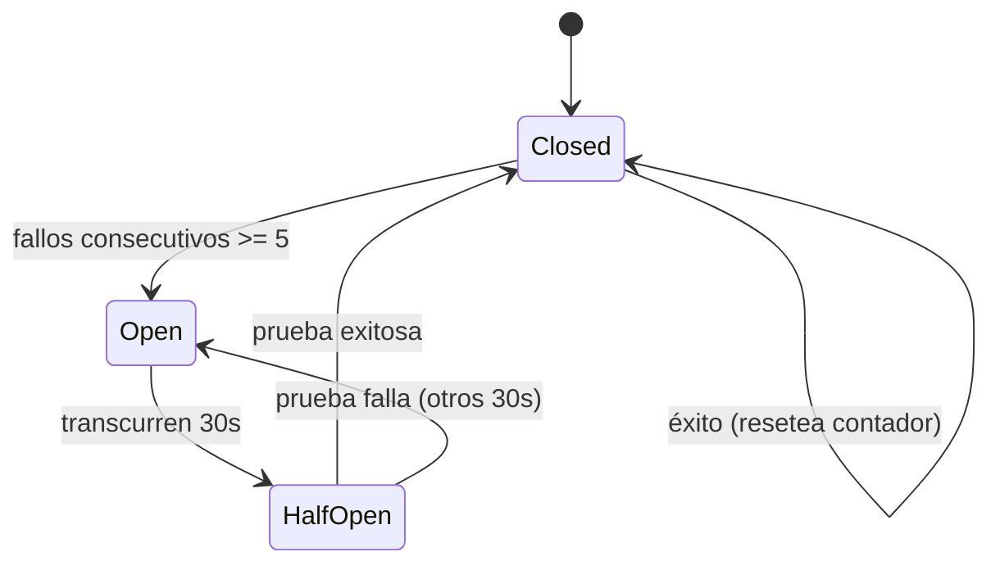

# Design Document

## Overview

**Consulta Cliente 360** permite a un usuario autorizado consultar la información consolidada de un cliente a partir de su tipo y número de documento. El diseño respeta la separación de capas corporativa mediante el patrón **Backend for Frontend (BFF)**:

- **Presentación (Angular):** vista `consulta360` con un formulario reactivo (Tipo_Documento y Numero_Documento) y un área de resultados lado a lado. No contiene lógica de negocio, no conoce credenciales y solo llama al backend propio (Req 1.9, 2.8).
- **Lógica (Express BFF):** endpoint REST versionado que valida la entrada, obtiene y reutiliza el token OAuth2, ejecuta la consulta GraphQL contra Conecta, enmascara la PII y devuelve un DTO explícito (Req 3, 4, 5, 6).
- **Persistencia / Datos externos:** servicio externo **Conecta DataOps** (endpoint OAuth2 + endpoint GraphQL). El backend nunca expone el token ni las credenciales al frontend (Req 3.3).

El diseño reutiliza los componentes existentes del backend (`correlation-id`, `error-handler`, `logger`, `config`, `createApp`) y del frontend (routing lazy, componentes standalone `OnPush`), extendiéndolos sin inventar patrones nuevos.

### Decisiones de diseño clave

| Decisión | Elección | Rationale |
|---|---|---|
| Ruta del endpoint | `POST /seguros/api/v1/cliente360/consulta` | Sigue la convención de arquitectura `/dominio/api/v1/funcionalidad/entidad` y coincide con el glosario (`Cliente360_API`). Se documenta como fuente única de verdad en OpenAPI. |
| Método HTTP | `POST` | El cuerpo transporta un identificador de documento (dato sensible); `POST` evita exponer PII en URL/logs de acceso, y permite validación de cuerpo con Zod `.strict()`. |
| Cliente HTTP saliente | `fetch` global de Node 20 + `AbortController` | Evita añadir dependencias; cumple timeouts (Req 7.1, 7.2). |
| Validación de entrada | **Zod** `3.24.1` (pin exacto, desde JFrog) | Aprobado para stack Express (`rule-tech-libraries`). `.strict()` rechaza claves inesperadas (Req 3.6). |
| Caso "sin datos de cliente" | `200 OK` con `{ found: false }` | Distingue explícitamente "no existe cliente" de un error técnico (Req 2.4, 3). Ver rationale en Error Handling. |
| Cliente HTTP frontend | `HttpClient` de Angular (`inject()`) | Aprobado (`rule-tech-libraries`); no se usa axios. Requiere `provideHttpClient()`. |

## Architecture

### Diagrama de componentes



### Diagrama de secuencia (éxito, sin datos y error)



## Components and Interfaces

### Backend

Estructura propuesta (agrupada por dominio, `rule-code-style`):

```
backend/src/
  config.ts                      # (extendido) nuevas variables Conecta + fail-fast
  app.ts                         # (extendido) monta el router cliente360 + provideHttpClient N/A
  cliente360/
    cliente360-router.ts         # define POST /seguros/api/v1/cliente360/consulta
    cliente360-controller.ts     # valida (Zod) y delega en el service
    cliente360-service.ts        # orquestación: token -> breaker -> graphql -> mask
    cliente360-schema.ts         # Zod .strict() del cuerpo
    cliente360-dto.ts            # ClienteResponseDTO + tipos de resultado
    token-service.ts             # caché OAuth2
    graphql-client.ts            # consulta GraphQL + reintento 401
    circuit-breaker.ts           # máquina de estados closed/open/half-open
    pii-masking.ts               # enmascaramiento + allowlist
    conecta-types.ts             # tipos request/response externos
```

#### config.ts (extensión)

Añade `conecta` al `AppConfig` congelado, con funciones `parse*` dedicadas y **fail-fast** al arranque para los secretos requeridos (Req 9.2, 9.3). Los secretos se leen **solo** de `process.env` (Req 9.1).

```ts
export interface ConectaConfig {
  readonly tokenUrl: string;          // CONECTA_TOKEN_URL (https:// obligatorio)
  readonly graphqlUrl: string;        // CONECTA_GRAPHQL_URL (https:// obligatorio)
  readonly clientId: string;          // CONECTA_CLIENT_ID (requerido, no vacío)
  readonly clientSecret: string;      // CONECTA_CLIENT_SECRET (requerido, no vacío)
  readonly scope: string;             // CONECTA_SCOPE (default SrcServerCognitoConecta/ConectaApiScope)
  readonly xUserKey: string;          // CONECTA_X_USER_KEY (requerido, no vacío)
  readonly tokenTimeoutMs: number;    // CONECTA_TOKEN_TIMEOUT_MS (default 5000)
  readonly graphqlTimeoutMs: number;  // CONECTA_GRAPHQL_TIMEOUT_MS (default 15000)
  readonly tokenRefreshMarginMs: number;   // default 60000
  readonly breakerFailureThreshold: number; // default 5
  readonly breakerRecoveryMs: number;       // default 30000
}
```

Validación: `parseRequiredSecret(name, raw)` aplica `trim()` y lanza `Error` nombrando la variable (sin valor) si está vacía; `parseHttpsUrl` exige protocolo `https:` (Req seguridad, SSRF allowlist implícita al fijar dominios por env). Al importar `config.ts`, un secreto faltante aborta el arranque **antes** de aceptar solicitudes (Req 9.3). El valor nunca se registra (Req 9.5).

#### token-service.ts

```ts
interface CachedToken { readonly accessToken: string; readonly expiresAtMs: number; }

interface TokenService {
  /** Devuelve un token vigente, reusando la caché o refrescando según el margen. */
  getToken(correlationId: string): Promise<string>;
  /** Invalida la caché (llamado ante 401 del GraphQL). */
  invalidate(): void;
}
```

Comportamiento:
- Caché en memoria del módulo. Reusa mientras `expiresAtMs - now > tokenRefreshMarginMs` (Req 4.3); refresca en caso contrario (Req 4.4).
- Solicitud: `POST` a `tokenUrl` con `Content-Type: application/json`, cuerpo `{ grant_type, client_id, client_secret, scope }`, `AbortController` a 5s (Req 4.1, 7.1).
- Propaga `X-Correlation-ID` (Req 8.3).
- En error/timeout: lanza error controlado `AUTH_UPSTREAM_FAILED`; conserva la caché vigente si existía (Req 4.5). Nunca registra token, `client_id` ni `client_secret` (Req 4.6, 6.5).
- `invalidate()` limpia la caché para forzar refresco en el reintento 401 (Req 5.8).

#### graphql-client.ts

```ts
interface GraphQLClient {
  /** Ejecuta la consulta de cliente; reintenta una vez ante 401. */
  consultarCliente(input: ConsultaInput, correlationId: string): Promise<ConectaClienteData | null>;
}
```

Comportamiento:
- `POST` a `graphqlUrl` con headers `Content-Type: application/json`, `Authorization: Bearer <token>`, `x-user-key: <env>`, `X-Correlation-ID` (Req 5.1, 8.3).
- Cuerpo `{ query, variables: { tipoDocumento: string, numeroDocumento: number } }`. `numeroDocumento` se serializa como valor **numérico** JSON (BigInt lógico) en el rango 1–9.999.999.999.999.999 (Req 5.3). Nota: se envía como `number`; los valores del rango de negocio (≤ 9.999.999.999) están dentro de `Number.MAX_SAFE_INTEGER`, por lo que no hay pérdida de precisión.
- `AbortController` a 15s → error `UPSTREAM_TIMEOUT` (Req 5.6, 7.2, 7.3).
- Si el cuerpo trae `errors` GraphQL → error controlado `UPSTREAM_ERROR` sin exponer detalle (Req 5.7).
- Ante `401`: llama `tokenService.invalidate()` y reintenta **una sola vez** con token nuevo (Req 5.8). Si el reintento también es 401 → error `AUTH_UPSTREAM_FAILED` sin más reintentos (Req 5.9).
- Si `x-user-key` está ausente/vacío → no envía y retorna error `CONFIG_MISSING` (Req 5.2). Este caso se previene además por el fail-fast de `config.ts`.

**Consulta GraphQL exacta:**

```graphql
query ConsultaCliente360($tipoDocumento: String!, $numeroDocumento: BigInt!) {
  cliente(tipoDocumento: $tipoDocumento, numeroDocumento: $numeroDocumento) {
    demografica { edad }
    contacto {
      mejorCelular { numeroCelular fuente }
      celulares { numeroCelular fuente }
    }
    cliente360 {
      clv
      categoriaIngresos
      antiguedad
      ciudad
      productoRecomendado
      aptoAutos
      aptoHogar
      aptoSalud
      aptoVida
    }
    valorIngresos
  }
}
```

#### circuit-breaker.ts

Máquina de estados para el endpoint GraphQL (Req 7.4, 7.5):



- `Closed`: cuenta fallos consecutivos; un éxito resetea el contador.
- `Open`: rechaza de inmediato con `CIRCUIT_OPEN` → `503`, sin invocar el servicio (Req 7.4).
- `HalfOpen`: permite **una** solicitud de prueba; éxito → `Closed`, fallo → `Open` por otros 30s (Req 7.5).

#### cliente360-schema.ts (Zod)

```ts
export const consultaSchema = z.object({
  tipoDocumento: z.literal("CC"),                          // Req 3.4
  numeroDocumento: z.number().int().positive().max(9_999_999_999), // Req 3.5
}).strict();                                               // Req 3.6 (rechaza claves extra)
```

El controller valida con `safeParse`. En fallo → `400` con `error.code = "VALIDATION_ERROR"` y `field` señalando el campo/clave inválida, **sin invocar servicios externos** (Req 3.4, 3.5, 3.6, 3.7). El frontend acepta dígitos como texto (1–15) y los convierte a número antes de enviar; el backend valida independientemente (Zero Trust, `rule-security`).

#### cliente360-controller.ts / router

- Registra `POST /seguros/api/v1/cliente360/consulta` (Req 3.1).
- Añade `methods: ["GET","POST"]` a la config CORS existente y `express.json` (ya presente) para el cuerpo.
- Devuelve `200` con `{ found: true, cliente }` (DTO enmascarado), `200` con `{ found: false }` (sin datos), o delega errores al `errorHandler` existente devolviendo el shape `{ correlationId, error: { code, message } }`.

### Frontend

```
frontend/src/app/
  app.config.ts                  # (extendido) + provideHttpClient()
  app.routes.ts                  # (extendido) + ruta lazy 'consulta360'
  features/consulta360/
    consulta360.ts               # Consulta360Component (standalone, OnPush)
    consulta360.html
    consulta360.scss
    consulta-cliente.service.ts  # ConsultaClienteService (HttpClient)
    consulta360-models.ts        # tipos de request/response/estado
  environments/
    environment.ts               # apiBaseUrl
```

#### app.config.ts (extensión)

Se añade `provideHttpClient()` a `providers` (requerido porque `HttpClient` aún no está provisto).

#### app.routes.ts (extensión)

```ts
{
  path: 'consulta360',
  loadComponent: () => import('./features/consulta360/consulta360').then((m) => m.Consulta360Component),
}
```

#### Consulta360Component

- Standalone, `ChangeDetectionStrategy.OnPush`, `templateUrl` + `styleUrl` separados (patrón `HomeComponent`).
- Formulario reactivo (`@angular/forms`):

```ts
form = this.fb.nonNullable.group({
  tipoDocumento: this.fb.nonNullable.control<'CC'>('CC', [Validators.required]),
  numeroDocumento: this.fb.nonNullable.control('', [Validators.required, Validators.pattern(/^[0-9]{1,15}$/)]),
});
```

- `tipoDocumento`: `<select>` con única opción `CC`, seleccionada por defecto (Req 1.1).
- `numeroDocumento`: `<input>` de texto; el patrón `^[0-9]{1,15}$` cubre solo dígitos y longitud 1–15 (Req 1.2, 1.4, 1.5, 1.6).
- Botón "Enviar" con `[disabled]="form.invalid || state === 'loading'"` (Req 1.7, 2.5).
- Layout lado a lado (form a la izquierda, resultados a la derecha) mediante CSS grid/flex en `.scss` (Req 2.1).
- Timeout cliente 15s vía `timeout(15000)` de RxJS sobre el `Observable` (Req 2.6).

Estados de vista (una señal/propiedad discriminada):

| Estado | Render |
|---|---|
| `idle` | Área de resultados vacía |
| `loading` | Indicador de progreso continuo (Req 2.5) |
| `success` | Campos demográficos/contacto/Cliente360; `"No disponible"` por campo ausente (Req 2.2, 2.3) |
| `noData` | Mensaje exacto `"No existe información de este cliente"` (Req 2.4) |
| `error` | Mensaje de error genérico, sin detalle técnico (Req 2.6, 2.7) |

#### ConsultaClienteService

```ts
@Injectable({ providedIn: 'root' })
export class ConsultaClienteService {
  private readonly http = inject(HttpClient);
  private readonly baseUrl = environment.apiBaseUrl;

  /** Envía la consulta al backend propio y devuelve el resultado tipado. */
  consultar(request: ConsultaRequest): Observable<ConsultaResult> {
    return this.http.post<ConsultaApiResponse>(
      `${this.baseUrl}/seguros/api/v1/cliente360/consulta`, request,
    ).pipe(timeout(15000), map(toResult));
  }
}
```

- Solo llama al backend propio (Req 1.9, 1.8). No usa `localStorage`/`sessionStorage` (Req 2.8).

## Data Models

### Tipos externos (Conecta) — `conecta-types.ts`

```ts
// Token OAuth2
interface TokenRequest {
  readonly grant_type: 'client_credentials';
  readonly client_id: string;
  readonly client_secret: string;
  readonly scope: string;
}
interface TokenResponse {
  readonly access_token: string;
  readonly token_type: string;   // "Bearer"
  readonly expires_in: number;   // segundos
}

// GraphQL
interface GraphQLRequest {
  readonly query: string;
  readonly variables: { readonly tipoDocumento: string; readonly numeroDocumento: number };
}
interface GraphQLResponse<T> {
  readonly data?: { readonly cliente: T | null };
  readonly errors?: ReadonlyArray<{ readonly message: string }>;
}
interface ConectaClienteData {
  readonly demografica: { readonly edad: number | null } | null;
  readonly contacto: {
    readonly mejorCelular: { readonly numeroCelular: string | null; readonly fuente: string | null } | null;
    readonly celulares: ReadonlyArray<{ readonly numeroCelular: string | null; readonly fuente: string | null }> | null;
  } | null;
  readonly cliente360: {
    readonly clv: string | null; readonly categoriaIngresos: string | null;
    readonly antiguedad: number | null; readonly ciudad: string | null;
    readonly productoRecomendado: string | null;
    readonly aptoAutos: boolean | null; readonly aptoHogar: boolean | null;
    readonly aptoSalud: boolean | null; readonly aptoVida: boolean | null;
  } | null;
  readonly valorIngresos: number | null;
}
```

### DTO de respuesta enmascarado (allowlist) — `cliente360-dto.ts`

```ts
interface CelularDTO { readonly numeroCelular: string; readonly fuente: string | null; } // numeroCelular enmascarado
interface ClienteResponseDTO {
  readonly demografica: { readonly edad: number | null };
  readonly contacto: {
    readonly mejorCelular: CelularDTO | null;
    readonly celulares: ReadonlyArray<CelularDTO>;
  };
  readonly cliente360: {
    readonly clv: string | null; readonly categoriaIngresos: string | null;
    readonly antiguedad: number | null; readonly ciudad: string | null;
    readonly productoRecomendado: string | null;
    readonly aptoAutos: boolean | null; readonly aptoHogar: boolean | null;
    readonly aptoSalud: boolean | null; readonly aptoVida: boolean | null;
  };
  readonly valorIngresos: number | null;
}

// Resultado discriminado (éxito vs sin datos)
type ConsultaApiResponse =
  | { readonly found: true; readonly cliente: ClienteResponseDTO }
  | { readonly found: false };
```

**Política de enmascaramiento (Req 6):**
- `numeroCelular`: se expone solo los últimos 4 dígitos; el resto se sustituye por `*` (Req 6.1). Menos de 4 dígitos / vacío / nulo → totalmente enmascarado (Req 6.2).
- `edad` y `valorIngresos`: el glosario los clasifica como PII. **Decisión:** al ser valores numéricos donde el enmascaramiento parcial no aporta y su ocultamiento total rompe el objetivo funcional (perfilamiento), se **retornan en claro dentro del DTO allowlist** (son datos agregados de perfil, no identificadores directos), pero se **excluyen de logs y errores** (Req 6.5, 8.6). Se documenta esta decisión para revisión de cumplimiento; si Habeas Data lo exige, se cambia a rangos/bandas sin afectar el contrato del frontend.
- El DTO es una **allowlist estricta**: cualquier campo extra recibido de Conecta se descarta; nunca se serializa el objeto completo (Req 6.4).

### Error response del backend (reutiliza el shape existente)

```ts
interface ErrorResponse {
  readonly correlationId: string;
  readonly error: { readonly code: string; readonly message: string; readonly field?: string };
}
```

### Modelos del frontend — `consulta360-models.ts`

```ts
interface ConsultaRequest { readonly tipoDocumento: 'CC'; readonly numeroDocumento: number; }
type ViewState = 'idle' | 'loading' | 'success' | 'noData' | 'error';
type ConsultaResult =
  | { readonly kind: 'success'; readonly cliente: ClienteResponseDTO }
  | { readonly kind: 'noData' }
  | { readonly kind: 'error' };
```

## Correctness Properties

*A property is a characteristic or behavior that should hold true across all valid executions of a system — essentially, a formal statement about what the system should do. Properties serve as the bridge between human-readable specifications and machine-verifiable correctness guarantees.*

Las propiedades siguientes consolidan los criterios de aceptación testeables (ver prework). Cada una se implementará con **una única** prueba basada en propiedades (mínimo 100 iteraciones).

### Property 1: Validación de documento en el frontend

*Para toda* cadena de entrada en el campo Numero_Documento y con Tipo_Documento = `CC`, el formulario es válido (y el botón "Enviar" habilitado) **si y solo si** la cadena coincide con `^[0-9]{1,15}$`; en cualquier otro caso el formulario es inválido y el botón queda deshabilitado.

**Validates: Requirements 1.2, 1.4, 1.5, 1.6, 1.7**

### Property 2: Validación de la solicitud en el backend sin efectos externos

*Para todo* cuerpo de solicitud, el Cliente360_API alcanza la orquestación (token/GraphQL) **si y solo si** `tipoDocumento === "CC"` y `numeroDocumento` es un entero positivo en `[1, 9_999_999_999]` y no existen claves inesperadas; en cualquier otro caso responde `400` y **no** invoca ningún servicio externo.

**Validates: Requirements 3.4, 3.5, 3.6, 3.7, 5.4**

### Property 3: Reutilización y refresco del token en el margen de 60s

*Para todo* token en caché con tiempo restante hasta expiración `r`, el Token_Service solicita un token nuevo **si y solo si** `r <= 60_000 ms`; de lo contrario reutiliza el token en caché sin realizar una solicitud saliente.

**Validates: Requirements 4.3, 4.4**

### Property 4: Invariante de enmascaramiento de PII

*Para toda* cadena de entrada `v` y cantidad de caracteres a revelar `k` (4 para celular, ≤4 para documento/correo), la salida enmascarada revela exactamente los últimos `min(k, dígitos/caracteres significativos de v)` caracteres, sustituye todos los demás por el carácter de máscara fijo, y **nunca** expone ningún carácter original fuera de ese sufijo; si `v` tiene menos de `k` caracteres significativos, o es vacía/nula, la salida no expone ningún carácter original.

**Validates: Requirements 6.1, 6.2, 6.3**

### Property 5: Allowlist de salida y redacción de secretos/PII

*Para todo* dato recibido de Conecta o error interno, la respuesta emitida al frontend contiene únicamente claves del `ClienteResponseDTO` (allowlist) con la PII enmascarada, y ni la respuesta ni ningún log estructurado emitido contienen el `OAuth2_Token`, el `client_secret`, el `client_id`, la `x-user-key` ni valores de PII sin enmascarar.

**Validates: Requirements 3.3, 6.4, 6.5, 8.6, 9.5**

### Property 6: Invariante de encabezados y propagación de Correlation-ID en llamadas salientes

*Para toda* solicitud entrante con Correlation_ID `c`, toda llamada saliente al Conecta_Token_Endpoint y al Conecta_GraphQL_Endpoint incluye el encabezado `X-Correlation-ID` igual a `c`, y toda llamada al GraphQL incluye además `Content-Type: application/json`, `Authorization: Bearer <token>` y `x-user-key`.

**Validates: Requirements 5.1, 8.3**

## Error Handling

El backend traduce cada falla a un estado HTTP y un mensaje **genérico** al cliente, registrando internamente la causa (sin PII/secretos). Reutiliza el `errorHandler` existente (`{ correlationId, error: { code, message } }`).

| Falla | HTTP | `error.code` | Mensaje al cliente (genérico) | Requisitos |
|---|---|---|---|---|
| Validación de entrada (tipo, rango, claves extra) | `400` | `VALIDATION_ERROR` | "La solicitud no pudo ser procesada." + `field` | 3.4, 3.5, 3.6, 3.7 |
| Sin token / rechazo de autenticación externa (incl. 401 tras reintento) | `502` | `AUTH_UPSTREAM_FAILED` | "El servicio externo no está disponible." | 3.8, 4.5, 5.9 |
| Timeout de token o GraphQL | `504` | `UPSTREAM_TIMEOUT` | "El servicio externo no respondió a tiempo." | 5.6, 7.3 |
| Errores GraphQL / indisponibilidad | `502` | `UPSTREAM_ERROR` | "El servicio externo no está disponible." | 5.7, 3.9 |
| Circuit breaker abierto | `503` | `CIRCUIT_OPEN` | "El servicio no está disponible temporalmente." | 7.4, 7.5 |
| Configuración faltante (arranque) | — (aborta arranque) | `CONFIG_MISSING` | N/A (no acepta solicitudes) | 9.2, 9.3 |
| **Sin datos de cliente** | `200` | — | `{ found: false }` | 2.4, 3 |

**Rationale del caso "sin datos" (`200` + `found:false`):** se elige `200` con una bandera explícita en lugar de `404` para diferenciar inequívocamente "el cliente no existe" (resultado de negocio válido) de un error técnico. Esto permite al frontend mostrar el mensaje exacto `"No existe información de este cliente"` (Req 2.4) sin acoplarlo al manejo de errores HTTP genéricos, evitando que un `404` de infraestructura se confunda con ausencia de datos.

**Frontend:** cualquier `error.code` o fallo de red/timeout se mapea al estado `error` con mensaje genérico (Req 2.7); `found:false` → estado `noData` (Req 2.4); `timeout(15000)` → estado `error` conservando la interfaz previa (Req 2.6).

## Security Considerations

- **Secretos solo por entorno:** `client_id`, `client_secret`, `x-user-key` se leen exclusivamente de `process.env`, sin defaults embebidos; fail-fast al arranque si faltan (Req 9.1–9.3). `backend/.env.example` declara cada variable con placeholders no reales (Req 9.4).
- **Sin secretos/tokens/PII en logs:** el `logger` estructurado excluye valores sensibles; se registran nombres de campo o valores enmascarados (Req 4.6, 6.5, 8.6, 9.5).
- **Enmascaramiento de PII:** celulares (últimos 4 dígitos), documento/correo (últimos 4 caracteres); allowlist DTO estricta (Req 6).
- **Sin tokens en el navegador:** el frontend no usa `localStorage`/`sessionStorage`; el token vive solo en el backend (Req 2.8).
- **HTTPS a Conecta:** `parseHttpsUrl` exige `https:` para ambos endpoints; los dominios se fijan por env (mitigación SSRF: no se aceptan URLs arbitrarias del cliente).
- **Zod `.strict()`:** validación de tipo/formato/longitud/rango en servidor, rechazo de claves inesperadas (Zero Trust Input).
- **helmet + CORS allowlist:** ya presentes en `createApp`; se mantiene la lista explícita de orígenes y encabezados.
- **Errores genéricos:** nunca se expone stack trace, cuerpo crudo de Conecta ni detalle técnico al cliente (Req 2.7, 3.9).
- **Correlation-ID:** propagado a todas las llamadas salientes para trazabilidad (Req 8.3), sin transportar datos sensibles.

## Testing Strategy

Enfoque dual: **pruebas unitarias/ejemplo** para casos concretos y de borde, y **pruebas basadas en propiedades (PBT)** para las invariantes universales. PBT es apropiado aquí porque el núcleo (validación, enmascaramiento, lógica de caché de token, breaker) son funciones con entrada/salida clara y espacio de entrada amplio.

### Herramientas

- **Backend:** Jest `29.7.0` + Supertest `7.0.0` (pin exacto, desde JFrog) + `fast-check` `3.23.1` para PBT. `fetch` global se mockea (p. ej. `jest.spyOn(globalThis, 'fetch')`).
- **Frontend:** Angular TestBed + Jest (según `rule-code-style`) + `fast-check` para las propiedades de validación/estado.
- Todas las pruebas de propiedad: **mínimo 100 iteraciones**; cada una etiquetada con comentario `Feature: consulta-cliente-360, Property {n}: {texto}`.

### Backend — unitarias / ejemplo

- **TokenService:** reuso de caché vigente; refresco al expirar; `invalidate()` ante 401; timeout 5s (AbortController); no registra secretos (Req 4.1, 4.3–4.6, 5.8, 7.1).
- **GraphQLClient:** headers correctos; `numeroDocumento` numérico; reintento único ante 401 y corte tras segundo 401; timeout 15s → error; manejo de `errors` GraphQL (Req 5.1–5.9, 7.2, 7.3).
- **PII masking:** ejemplos de últimos 4 dígitos y borde `<4` dígitos/vacío/nulo (Req 6.1, 6.2, 6.3).
- **Zod schema:** rechaza `tipoDocumento` ≠ CC, `numeroDocumento` no positivo/fuera de rango, claves extra (Req 3.4–3.6).
- **Circuit breaker:** transición Closed→Open a los 5 fallos; Open→HalfOpen tras 30s (fake timers); HalfOpen→Closed/Open (Req 7.4, 7.5).
- **Endpoint (Supertest):** ruta versionada existe; `200 found:true`, `200 found:false`, `400`, `502/503/504` con shape de error correcto (Req 3.1, 3.8, 3.9).
- **Config fail-fast:** arranque aborta y nombra variables faltantes sin valor (Req 9.2, 9.3); `.env.example` contiene placeholders (Req 9.4).

### Frontend — unitarias / ejemplo

- Select `CC` por defecto (Req 1.1); layout lado a lado (Req 2.1).
- Botón habilitado/deshabilitado según validez; una sola llamada al backend al enviar (Req 1.3, 1.7, 1.8).
- Estados de vista: `loading` (spinner), `success` (render + "No disponible" por campo ausente), `noData` (mensaje exacto `"No existe información de este cliente"`), `error` (mensaje genérico), timeout 15s (Req 2.2–2.7).
- El servicio no escribe en `localStorage`/`sessionStorage` (Req 2.8).

### Property-based tests (mapeo)

| Propiedad | Ubicación | Qué se genera |
|---|---|---|
| P1 Validación frontend | `consulta360.spec` | Cadenas arbitrarias; validez = match `^[0-9]{1,15}$` |
| P2 Validación backend sin externos | `cliente360-controller.spec` | Cuerpos arbitrarios; 400 sin invocar mocks salvo entrada válida |
| P3 Token reuso/refresco | `token-service.spec` | Offsets de expiración; refresco ⇔ `r ≤ 60s` |
| P4 Enmascaramiento PII | `pii-masking.spec` | Cadenas/números arbitrarios; sufijo revelado exacto |
| P5 Allowlist + redacción | `cliente360-service.spec` | Objetos upstream con claves extra + errores; claves ⊆ DTO, sin secretos/PII |
| P6 Headers + correlation | `graphql-client.spec` / `token-service.spec` | Correlation-IDs; headers salientes correctos |

**Fuera de PBT:** el objetivo p95 < 15s (Req 7.6) se valida con pruebas de carga/integración, no unitarias. La verificación de logs centralizados y el comportamiento del propio Express (`json.strict`, helmet) se cubren con integración/smoke.
